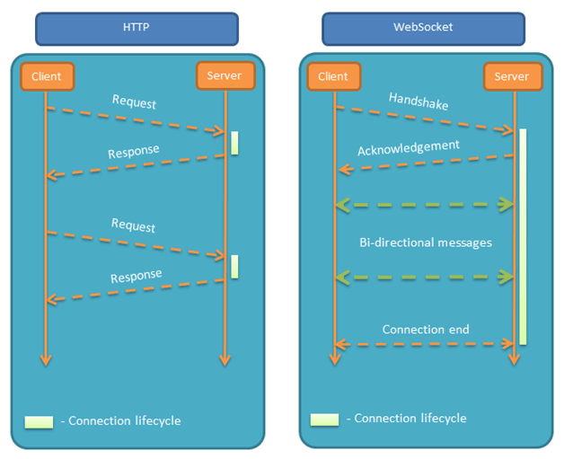

## WebSocket的应用

Tornado的异步特性使其非常适合处理高并发的业务，同时也适合那些需要在客户端和服务器之间维持长连接的业务。传统的基于HTTP协议的Web应用，服务器和客户端（浏览器）的通信只能由客户端发起，这种单向请求注定了如果服务器有连续的状态变化，客户端（浏览器）是很难得知的。事实上，今天的很多Web应用都需要服务器主动向客户端（浏览器）发送数据，我们将这种通信方式称之为“推送”。过去很长一段时间，程序员都是用定时轮询（Polling）或长轮询（Long Polling）等方式来实现“推送”，但是这些都不是真正意义上的“推送”，而且浪费资源且效率低下。在HTML5时代，可以通过一种名为WebSocket的技术在服务器和客户端（浏览器）之间维持传输数据的长连接，这种方式可以实现真正的“推送”服务。

### WebSocket简介

WebSocket 协议在2008年诞生，2011年成为国际标准（[RFC 6455](https://tools.ietf.org/html/rfc6455)），现在的浏览器都能够支持它，它可以实现浏览器和服务器之间的全双工通信。我们之前学习或了解过Python的Socket编程，通过Socket编程，可以基于TCP或UDP进行数据传输；而WebSocket与之类似，只不过它是基于HTTP来实现通信握手，使用TCP来进行数据传输。WebSocket的出现打破了HTTP请求和响应只能一对一通信的模式，也改变了服务器只能被动接受客户端请求的状况。目前有很多Web应用是需要服务器主动向客户端发送信息的，例如股票信息的网站可能需要向浏览器发送股票涨停通知，社交网站可能需要向用户发送好友上线提醒或聊天信息。



WebSocket的特点如下所示：

1. 建立在TCP协议之上，服务器端的实现比较容易。
2. 与HTTP协议有着良好的兼容性，默认端口是80（WS）和443（WSS），通信握手阶段采用HTTP协议，能通过各种 HTTP 代理服务器（不容易被防火墙阻拦）。
3. 数据格式比较轻量，性能开销小，通信高效。
4. 可以发送文本，也可以发送二进制数据。
5. 没有同源策略的限制，客户端（浏览器）可以与任意服务器通信。


### WebSocket服务器端编程

Tornado框架中有一个`tornado.websocket.WebSocketHandler`类专门用于处理来自WebSocket的请求，通过继承该类并重写`open`、`on_message`、`on_close` 等方法来处理WebSocket通信，下面我们对`WebSocketHandler`的核心方法做一个简单的介绍。

1. `open(*args, **kwargs)`方法：建立新的WebSocket连接后，Tornado框架会调用该方法，该方法的参数与`RequestHandler`的`get`方法的参数类似，这也就意味着在`open`方法中可以执行获取请求参数、读取Cookie信息这样的操作。

2. `on_message(message)`方法：建立WebSocket之后，当收到来自客户端的消息时，Tornado框架会调用该方法，这样就可以对收到的消息进行对应的处理，必须重写这个方法。

3. `on_close()`方法：当WebSocket被关闭时，Tornado框架会调用该方法，在该方法中可以通过`close_code`和`close_reason`了解关闭的原因。

4. `write_message(message, binary=False)`方法：将指定的消息通过WebSocket发送给客户端，可以传递utf-8字符序列或者字节序列，如果message是一个字典，将会执行JSON序列化。正常情况下，该方法会返回一个`Future`对象；如果WebSocket被关闭了，将引发`WebSocketClosedError`。

5. `set_nodelay(value)`方法：默认情况下，因为TCP的Nagle算法会导致短小的消息被延迟发送，在考虑到交互性的情况下就要通过将该方法的参数设置为`True`来避免延迟。

6. `close(code=None, reason=None)`方法：主动关闭WebSocket，可以指定状态码（详见[RFC 6455 7.4.1节](https://tools.ietf.org/html/rfc6455#section-7.4.1)）和原因。

### WebSocket客户端编程

1. 创建WebSocket对象。

   ```JavaScript
   var webSocket = new WebSocket('ws://localhost:8000/ws');
   ```

   >说明：webSocket对象的readyState属性表示该对象当前状态，取值为CONNECTING-正在连接，OPEN-连接成功可以通信，CLOSING-正在关闭，CLOSED-已经关闭。

2. 编写回调函数。

   ```JavaScript
   webSocket.onopen = function(evt) { webSocket.send('...'); };
   webSocket.onmessage = function(evt) { console.log(evt.data); };
   webSocket.onclose = function(evt) {};
   webSocket.onerror = function(evt) {};
   ```

   > 说明：如果要绑定多个事件回调函数，可以用addEventListener方法。另外，通过事件对象的data属性获得的数据可能是字符串，也有可能是二进制数据，可以通过webSocket对象的binaryType属性（blob、arraybuffer）或者通过typeof、instanceof运算符检查类型进行判定。

### 项目：Web聊天室

```python
"""
handlers.py - 用户登录和聊天的处理器
"""
import tornado.web
import tornado.websocket

nicknames = set()
connections = {}


class LoginHandler(tornado.web.RequestHandler):

    def get(self):
        self.render('login.html', hint='')

    def post(self):
        nickname = self.get_argument('nickname')
        if nickname in nicknames:
            self.render('login.html', hint='昵称已被使用，请更换昵称')
        self.set_secure_cookie('nickname', nickname)
        self.render('chat.html')


class ChatHandler(tornado.websocket.WebSocketHandler):

    def open(self):
        nickname = self.get_secure_cookie('nickname').decode()
        nicknames.add(nickname)
        for conn in connections.values():
            conn.write_message(f'~~~{nickname}进入了聊天室~~~')
        connections[nickname] = self

    def on_message(self, message):
        nickname = self.get_secure_cookie('nickname').decode()
        for conn in connections.values():
            if conn is not self:
                conn.write_message(f'{nickname}说：{message}')

    def on_close(self):
        nickname = self.get_secure_cookie('nickname').decode()
        del connections[nickname]
        nicknames.remove(nickname)
        for conn in connections.values():
            conn.write_message(f'~~~{nickname}离开了聊天室~~~')

```

```python
"""
run_chat_server.py - 聊天服务器
"""
import os

import tornado.web
import tornado.ioloop

from handlers import LoginHandler, ChatHandler


if __name__ == '__main__':
    app = tornado.web.Application(
        handlers=[(r'/login', LoginHandler), (r'/chat', ChatHandler)],
        template_path=os.path.join(os.path.dirname(__file__), 'templates'),
        static_path=os.path.join(os.path.dirname(__file__), 'static'),
        cookie_secret='MWM2MzEyOWFlOWRiOWM2MGMzZThhYTk0ZDNlMDA0OTU=',
    )
    app.listen(8888)
    tornado.ioloop.IOLoop.current().start()
```

```HTML
<!-- login.html -->
<!DOCTYPE html>
<html lang="en">
<head>
    <meta charset="utf-8">
    <title>Tornado聊天室</title>
    <style>
        .hint { color: red; font-size: 0.8em; }
    </style>
</head>
<body>
    <div>
        <div id="container">
            <h1>进入聊天室</h1>
            <hr>
            <p class="hint">{{hint}}</p>
            <form method="post" action="/login">
                <label>昵称：</label>
                <input type="text" placeholder="请输入你的昵称" name="nickname">
                <button type="submit">登录</button>
            </form>
        </div>
    </div>
</body>
</html>
```

```HTML
<!-- chat.html -->
<!DOCTYPE html>
<html lang="en">
<head>
    <meta charset="UTF-8">
    <title>Tornado聊天室</title>
</head>
<body>
    <h1>聊天室</h1>
    <hr>
    <div>
        <textarea id="contents" rows="20" cols="120" readonly></textarea>
    </div>
    <div class="send">
        <input type="text" id="content" size="50">
        <input type="button" id="send" value="发送">
    </div>
    <p>
        <a id="quit" href="javascript:void(0);">退出聊天室</a>
    </p>
    <script src="https://cdn.bootcss.com/jquery/3.3.1/jquery.min.js"></script>
    <script>
        $(function() {
            // 将内容追加到指定的文本区
            function appendContent($ta, message) {
                var contents = $ta.val();
                contents += '\n' + message;
                $ta.val(contents);
                $ta[0].scrollTop = $ta[0].scrollHeight;
            }
            // 通过WebSocket发送消息
            function sendMessage() {
                message = $('#content').val().trim();
                if (message.length > 0) {
                    ws.send(message);
                    appendContent($('#contents'), '我说：' + message);
                    $('#content').val('');
                }
            }
            // 创建WebSocket对象
            var ws= new WebSocket('ws://localhost:8888/chat');
            // 连接建立后执行的回调函数
            ws.onopen = function(evt) {
                $('#contents').val('~~~欢迎您进入聊天室~~~');
            };
            // 收到消息后执行的回调函数
            ws.onmessage = function(evt) {
                appendContent($('#contents'), evt.data);
            };
            // 为发送按钮绑定点击事件回调函数
            $('#send').on('click', sendMessage);
            // 为文本框绑定按下回车事件回调函数
            $('#content').on('keypress', function(evt) {
                keycode = evt.keyCode || evt.which;
                if (keycode == 13) {
                    sendMessage();
                }
            });
            // 为退出聊天室超链接绑定点击事件回调函数
            $('#quit').on('click', function(evt) {
                ws.close();
                location.href = '/login';
            });
        });
    </script>
</body>
</html>
```

